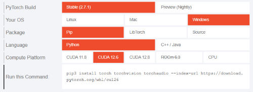

+++
title = '(docker上で)uvを使ってPyTorchの環境構築'
date = '2025-06-12T22:38:12+09:00'
draft = false
summary = 'docker上でuvを使ってPyTorchの環境構築をします。(需要があるかわかりませんが)Jupyter Labも入れられます。'
tags = ['Docker', 'UV', 'PyTorch', 'CUDA']
+++

皆さんはPythonの環境構築に`uv`は使っていますか？

比較的新しい、Pythonの様々なものを管理できるツールです。

少し前までは`PyTorch`の環境構築には、CUDAを含めた環境構築が楽にできる`Anaconda`が使われていたりしましたが、`Anaconda`は公式の`PyTorch`チャンネルを廃止してしまいました。



この記事では、`docker`を使ってCUDAが使えるコンテナを用意し、`uv`で`PyTorch`が使える環境を作る手順を紹介します(ついでに`Jupyter Lab`も入れられます)。

`docker`は使わないという場合は後半部分(「**uvでPyTorchを使えるようにする**」以降)を参照してください(CUDAを使える環境であることが前提条件となります)。


Jupyter LabでできることはほとんどVSCodeでできてしまうので、Jupyter Labの需要はあまりないかもしれません。

VSCodeでは`Remote Development`という拡張機能を入れることで、リモートサーバーで動いているコンテナを開くことができます。


**ホストの環境**
- `Ubuntu 24.04.1 LTS`

**前提条件**
- ホストに`docker`と`nvidia-container-toolkit`がインストールされている

`docker`がない場合は以下の公式ページを参考にインストールしてください。



`nvidia-container-toolkit`がない場合は以下の公式ページを参考にインストールしてください。



# Dockerfileの作成

さっそく`Dockerfile`を作っていきます。

基本形は以下の通りです。この`Dockerfile`で作ることのできるイメージは以下のようなものです。

- `CUDA12.6`を使うことができる
- 指定したユーザー名・UID・GIDのユーザーが作成される
- Jupyter Labが使える
- GitHub CLIが使える
- uvが使える
- 起動時にJupyter Labが立ち上がる

特筆すべき点はこの後に記載します。

```docker {name="Dockerfile"}
# ベースイメージを指定
FROM nvidia/cuda:12.6.3-cudnn-devel-ubuntu24.04

# 引数
ARG USERNAME=user
ARG UID=1000
ARG GID=1000

# 必要なパッケージを一度にインストール
RUN apt-get update && apt-get install -y \
    sudo \
    curl \
    wget \
    git \
    software-properties-common \
    gnupg \
    libcusparselt-dev \
    && rm -rf /var/lib/apt/lists/*

# sudo権限を持つユーザーを作成（echoをダブルクォートに修正）
RUN groupadd -g $GID $USERNAME &&\
useradd -m -u $UID -g $GID -s /bin/bash -G sudo $USERNAME && \
echo "$USERNAME ALL=(ALL) NOPASSWD:ALL" >> /etc/sudoers

# 作業ディレクトリを切り替え
USER $USERNAME
WORKDIR /home/$USERNAME
ENV PATH="/home/$USERNAME/.local/bin:$PATH"
    
# GitHub CLIのインストール
RUN sudo mkdir -p -m 755 /etc/apt/keyrings \
    && wget -qO- https://cli.github.com/packages/githubcli-archive-keyring.gpg | sudo tee /etc/apt/keyrings/githubcli-archive-keyring.gpg > /dev/null \
    && sudo chmod go+r /etc/apt/keyrings/githubcli-archive-keyring.gpg \
    && echo "deb [arch=$(dpkg --print-architecture) signed-by=/etc/apt/keyrings/githubcli-archive-keyring.gpg] https://cli.github.com/packages stable main" | sudo tee /etc/apt/sources.list.d/github-cli.list > /dev/null \
    && sudo apt update \
    && sudo apt install gh -y

# uvのインストール
RUN curl -LsSf https://astral.sh/uv/install.sh | sh

# Jupyter Labのインストール
RUN uv venv /home/$USERNAME/.venv
ENV PATH="/home/$USERNAME/.venv/bin:$PATH"
RUN uv pip install notebook jupyterlab

# ポートを開放
EXPOSE 8888

# Jupyter Labを起動する
CMD ["jupyter", "lab", "--no-browser", "--ip=0.0.0.0", "--port=8888"]
```


```docker
# ベースイメージを指定
FROM nvidia/cuda:12.6.3-cudnn-devel-ubuntu24.04

# 引数
ARG USERNAME=user
ARG UID=1000
ARG GID=1000

# 必要なパッケージを一度にインストール
RUN apt-get update && apt-get install -y \
    sudo \
    curl \
    wget \
    git \
    software-properties-common \
    gnupg \
    libcusparselt-dev \
    && rm -rf /var/lib/apt/lists/*

# sudo権限を持つユーザーを作成（echoをダブルクォートに修正）
RUN groupadd -g $GID $USERNAME &&\
useradd -m -u $UID -g $GID -s /bin/bash -G sudo $USERNAME && \
echo "$USERNAME ALL=(ALL) NOPASSWD:ALL" >> /etc/sudoers

# 作業ディレクトリを切り替え
USER $USERNAME
WORKDIR /home/$USERNAME
ENV PATH="/home/$USERNAME/.local/bin:$PATH"
    
# GitHub CLIのインストール
RUN sudo mkdir -p -m 755 /etc/apt/keyrings \
    && wget -qO- https://cli.github.com/packages/githubcli-archive-keyring.gpg | sudo tee /etc/apt/keyrings/githubcli-archive-keyring.gpg > /dev/null \
    && sudo chmod go+r /etc/apt/keyrings/githubcli-archive-keyring.gpg \
    && echo "deb [arch=$(dpkg --print-architecture) signed-by=/etc/apt/keyrings/githubcli-archive-keyring.gpg] https://cli.github.com/packages stable main" | sudo tee /etc/apt/sources.list.d/github-cli.list > /dev/null \
    && sudo apt update \
    && sudo apt install gh -y

# uvのインストール
RUN curl -LsSf https://astral.sh/uv/install.sh | sh

# なにもしないプロセスを作成
CMD ["sleep", "infinity"]
```


## ベースイメージの指定
最初にベースイメージを指定しています。ここでCUDAのバージョンと使用するOSを決めます。

```docker {name="Dockerfile(一部抜粋)"}
# ベースイメージを指定
FROM nvidia/cuda:12.6.3-cudnn-devel-ubuntu24.04
```

CUDAのバージョンと`PyTorch`のバージョンの対応はよく確認してください。

CUDAのバージョンによって使える`PyTorch`のバージョンが異なります(下記折りたたみを参照してください)。


下記Docker Hubのページから使用する`nvidia/cuda`のイメージを探します。タグが大量にあるので、使用したいCUDAのバージョンなどでフィルターをかけるのが良いと思います。

https://hub.docker.com/r/nvidia/cuda/tags

`{使用したいCUDAバージョン}-cudnn-devel-{OS名}`となっているタグを選びましょう。そうでないと、後々足りないものが出てきて面倒なことになります。

また、`PyTorch`が対応しているCUDAのバージョンを選ぶことも重要です。

`PyTorch`公式ページにCUDAのバージョンと`PyTorch`のバージョンの対応が書かれているので、使いたい`PyTorch`のバージョンが決まっている場合などはこれを参考にしてください。

https://pytorch.org/get-started/previous-versions/



選んだら、ベースイメージを指定している部分を以下のように書き換えます。
```docker
# ベースイメージを指定
FROM nvidia/cuda:{選択したタグ}
```

あるかわかりませんが、ここで`apt`を使えないOSを選んだ場合は今後`apt`が出てきた際にうまく書き換えてください。


## 引数の定義
以下の部分では引数を定義しています。

```docker
# 引数
ARG USERNAME=user
ARG UID=1000
ARG GID=1000
```

この`Dockerfile`では以下の値をビルド時に指定できます。
- ユーザー名
- UID
- GID

共用サーバーでこれを使う人は、ビルド時にUIDとGIDを指定することを推奨します。

以下の記事を見ると理由がわかります。

https://tech.n-island.dev/posts/20250503/

# イメージのビルド
作成したDockerfileを使ってビルドしてみましょう。

以下のコマンドでビルドできます。このようにすることで、コンテナ内のユーザー名とUID・GIDをホストのものと一致させることができます。

```bash
docker build \
  --build-arg USERNAME=$(whoami) \
  --build-arg UID=$(id -u) \
  --build-arg GID=$(id -g) \
  -t {イメージの保存名} .
```

ビルドには時間がかかるので気長に待ちましょう。

> [!TIP]
> 「途中でエラーが出てしまった」などの理由でログを保存したい場合は、以下のように`tee`コマンドを使います。
> ```bash
> docker build \
>  --build-arg USERNAME=$(whoami) \
>  --build-arg UID=$(id -u) \
>  --build-arg GID=$(id -g) \
>  -t {イメージの保存名} . 2>&1 | tee build.log
> ```

# コンテナの作成
ビルドしたイメージを使ってコンテナを立ち上げてみましょう。

以下のコマンドを実行します。ホスト側ポートは他のアプリケーションが使っていないものを選択しましょう。

`{イメージ名}`はビルドの際に指定した`{イメージの保存名}`です。

```bash
docker run --gpus all -d -p {任意のホスト側ポート}:8888 --name {任意のコンテナ名} {イメージ名}
```


Jupyter Labがない場合はポートを気にする必要がありません。
```bash
docker run --gpus all -d --name {任意のコンテナ名} {イメージ名}
```


Jupyter Labを入れた場合、下記コマンドをホストから実行することでブラウザからアクセスのための情報を得られます。

```bash
docker exec -u {コンテナ内に作成したユーザー名} {コンテナ名} jupyter server list
```

以下のような結果が得られます。

```txt
Currently running servers:
http://{コンテナ名}:8888/?token={トークン} :: /home/{ユーザー名}
```

この結果を基に、Jupyter Labには以下のURLでブラウザからアクセスできます。

### コンテナが作業している端末上で動いている場合

```txt
http://127.0.0.1:{docker runで指定したポート}/lab?token={トークン}
```

`{docker runで指定したポート}`は`docker run`において`{任意のホスト側ポート}`として指定したポート。

### コンテナがリモートサーバーで動いている場合

```txt
http://{リモートサーバーのIPアドレス}:{docker runで指定したポート}/lab?token={トークン}
```

# uvでPyTorchを使えるようにする
ようやく本題です。

プロジェクトを作成したい場所で以下のコマンドを実行します。

プロジェクト名を省略した場合は現在のディレクトリが初期化されます。

```bash
uv init {プロジェクト名}
cd {プロジェクト名} # 移動
```

上記コマンドを実行するとディレクトリの中は以下のような構成になっていると思います。

```txt
{プロジェクト名}
  |--.gitignore
  |--.python-version
  |--README.md
  |--main.py
  |--pyproject.toml
```

`uv`では`pyproject.toml`を用いてプロジェクトを管理します。

`pyproject.toml`を開いて以下のように追記します。

```toml
[project]
name = "{プロジェクト名}"
version = "0.1.0"
description = "Add your description here"
readme = "README.md"
requires-python = ">=3.12"
dependencies = []

# 追記
[tool.uv.sources]
torch = { index = "pytorch-cu126" }
torchvision = { index = "pytorch-cu126" }
torchaudio = { index = "pytorch-cu126" }

[[tool.uv.index]]
name = "pytorch-cu126"
url = "https://download.pytorch.org/whl/cu126"
explicit = true
```

ここで、以下のサイトでCUDAのバージョンと`PyTorch`のバージョンの対応を調べます。





これを基に、以下のコマンドを実行します。このコマンドはCUDAのバージョンや`PyTorch`のバージョンに合わせて変えてください。

今回はCUDA12.6を入れたので、使える`PyTorch`のバージョンは`2.6.0`のみのようです。

```bash
uv add torch==2.6.0+cu126 torchvision==0.21.0+cu126 torchaudio==2.6.0+cu126
```

これを実行すると、`torch`がインストールされます。

最後にCUDAが使えるか確認してみましょう。

```bash
uv run python

Python 3.12.3 (main, Feb  4 2025, 14:48:35) [GCC 13.3.0] on linux
>>> import torch
>>> torch.cuda.is_available()
True
```

ちゃんと使えていそうです。

# おわりに
今回はdocker上でCUDAが動くようにして`uv`で`PyTorch`の環境構築をしました。

Dockerfileはある程度使いまわせるとは思いますが、環境によってはライブラリが足りないなどの問題が起こる可能性もあり、その際は柔軟に対応する必要があります。

少なくとも今回紹介したDockerfileをそのまま使う分には問題は起きないと思われます。
