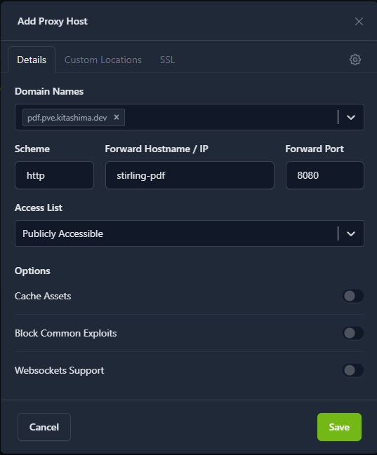

+++
aliases = []
date = 2026-02-24T18:14:06+09:00
draft = true
summary = 'Tailscaleのネットワーク内でのみ使うWEBサービスをhttpsで快適に使う方法です。'
tags = ['WEB', 'サーバー', 'Tailscale', 'Linux']
title = 'Tailscale内に立てたWEBサービスにSSL証明書を適用する'
url_title = 'tailscale-web-service'
+++

Tailscale内で立てたサービスをhttps化する方法を備忘録的に書きます (HTTPS Certificatesは使いません)。

## 背景
現在、Proxmoxで様々なサービスを立てていますが、外部に公開するものとしないものがあります。

外部に公開するものとしては、ファイル共有サービスやWEBアプリケーションがあります。これらはCloudflare Tunnelsで簡単に外部公開することができます。

一方で、外部に公開しないものとしてはNextcloudや拡張子変換サービスなどがあります。これらはTailscaleのネットワークに属させることで、外部からは見えない形で簡単にアクセス可能となります。

Tailscaleのネットワーク内でアクセスするとき、IPアドレスやMagic DNSを使う方法がありますが、自分はTailscale内にDNSサーバーを立てています。

自分が保有するドメインを割り当ててSplit DNSを使うことでドメインを使ってTailscale内の各サービスにアクセスできます。

このとき、1つだけ問題が発生します。

**証明書がないのでブラウザで警告が出たり、最悪の場合アクセスできなかったりします。**

## 前提
この記事では以下を前提に説明しています。

- ドメインをCloudflareで管理している
  - ドメイン管理がCloudflare以外であってもこの手は使えるはずです
- 立てるWEBサービスはdockerコンテナで動く
- ホストがTailscaleに接続済み
- 何らかの形でホストに対するドメインを用いた名前解決が可能

## 手順
### WEBサービスを立てる
今回はPDFファイル操作ができる `Stirling-PDF` を使います。



ホスト内で以下のような `docker-compose.yml` を作成します。

`stirling-pdf` が今回立てたいWEBサービスです。この部分は基本的にWEBサービスのドキュメント通りでよいです。

特殊な設定として、今回はnginxのプロキシとなるコンテナからアクセスできるようにしたいので `expose` で外部コンテナからのアクセスを許可しています。コンテナ内のどのポートでサービスが動いているか確かめてここに書き込みます。

加えて、`jc21/nginx-proxy-manager:latest` を入れています。これを使うことで、簡単に nginx のプロキシを設定できます。この部分はコピペで問題ありません。

```yml {name="docker-compose.yml"}
services:
  :
    image: stirlingtools/stirling-pdf:latest-fat
    container_name: stirling-pdf
    restart: always
    expose: 
      - "8080"
    volumes:
      - ./stirling-data:/configs

  nginx-proxy:
    image: 'jc21/nginx-proxy-manager:latest'
    container_name: nginx-proxy-manager
    restart: always
    ports:
      - '80:80'
      - '443:443'
      - '81:81'
    volumes:
      - ./data:/data
      - ./letsencrypt:/etc/letsencrypt
```

以下コマンドでコンテナ群を作成します。

```bash
docker compose up -d
```

### DNSを編集するためのAPIを取得する
Cloudflareのコンソールを開いて、左側メニューの 「アカウントの管理」>「アカウントAPIトークン」を開きます。

「トークンを作成する」をクリックし、下部「API トークン テンプレート」に「ゾーン DNS を編集する」があるので「テンプレートを使用する」をクリック。

以下の画像のような画面になるので、「ゾーンリソース」の一番右側で今回使用したいドメインを選択します。



ドメインを選択したら「概要に進む」>「トークンを作成する」でAPIトークンの作成を完了させます。

**画面にトークンが表示されるのでコピーしておいてください** (一度画面を閉じると見れなくなります)。

### Nginxのプロキシを設定する
IPアドレスを使ってホストのポート81にアクセスすると以下のような画面になります。

後ほどのDNS編集の際に使っている可能性があるので、メールアドレスは正しいものを入れておいた方がいいかもしれません。



設定が終わるとダッシュボードが開き、「0 Proxy Hosts」と表示されている部分をクリックします。

Proxy Hostsの画面になるので、「Add Proxy Host」をクリックして、まずは「Details」に以下のように情報を入力します。

- Domain Names: 今回使用したいドメイン名
- Scheme: 基本的にはhttp
- Forward Hostname: WEBサービスが動いているコンテナ名
- Forward Port: `expose` で指定したポート番号



次に、上部「SSL」を開き、以下のように設定します。

- SSL Certificate: Request a new Certificate
- Force SSL: ON
- User DNS Challenge: ON
  - DNS Provider: Cloudflare
  - Credentials File Content: `dns_cloudflare_api_token=` 以降を先ほど取得したAPIトークンに書き換え (画面に映っているのはダミーの値)



すべての入力が終わったら、「Save」を押します。

しばらくするとモーダルが閉じます。STATUSがOnlineになっていれば設定完了です。

### 確認する
設定したドメインにアクセスしてみます。



問題なくアクセスできています。証明書に関する警告も表示されていません。

## おわりに
何度か証明書の設定は行ってきましたが、毎回調べたりして詰まっていたので記事を書きました。

かなり楽に設定できる手順を開拓できた気がします。
